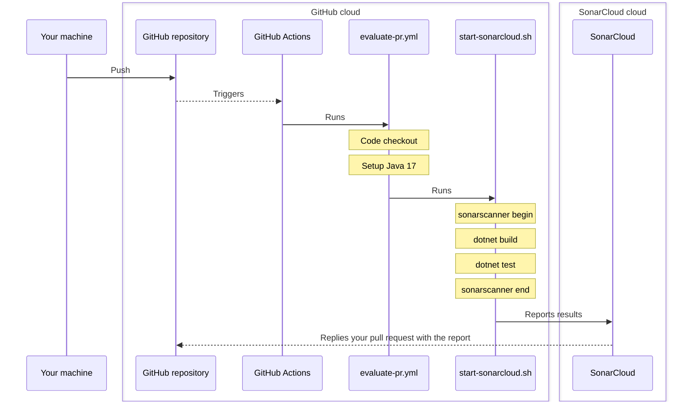

# Code analysis with SonarCloud and GitHub Actions

## Static code analysis

Static code analysis is the process of examining the source code of a software without running it, with the purpose of detecting bugs, finding code smells, improving the code, finding security issues, helping with reviewing pull requests, and more.

Popular code analysis tools include ESLint for JavaScript and SonarQube for many programming languages. SonarCloud, for example, can do a review on your pull requests every time it is updated, and reports bugs, vulnerabilities, security hotspots, code smells found, as well as % of test coverage and code duplication.

<figure><figcaption><p>Isn't it great?</p></figcaption></figure>

## SonarCloud

> SonarCloud is a cloud-based code analysis service designed to detect coding issues in[ 26 different programming languages](https://docs.sonarcloud.io/advanced-setup/languages/overview/). By integrating directly with your CI pipeline or one of our [supported DevOps platforms](https://docs.sonarcloud.io/getting-started/overview/), your code is checked against an extensive set of rules that cover many attributes of code, such as maintainability, reliability, and security issues on each merge/pull request. As a core element of our [Sonar solution](https://www.sonarsource.com/), SonarCloud completes the analysis loop to help you deliver clean code that meets high-quality standards.

The paragraph above was copied from [SonarCloud Docs](https://docs.sonarcloud.io/). SonarCloud is, in my words and in a short sentence, a managed service that does code analysis on demand for your repositories through CI pipelines.

Also, it's free for open source repositories. If your repo is private, you must pay to use it.

## GitHub Actions

GitHub Actions is a CI/CD service provided by GitHub to automate parts of the software development lifecycle, such as building, testing **and doing code analysis** configured mostly with YAML files under `./.github/workflows` folder of your repository.

I particularly find it incredible: it is on GitHub that you store your code, and on GitHub that you set up your CI/CD workflows. 🐐

<figure><figcaption><p>Everything in this folder is a workflow that will be run by GitHub Actions</p></figcaption></figure>

## The SonarCloud GitHub Action

For some programming languages, there is a ready-to-use [SonarCloud GitHub Action](https://github.com/SonarSource/sonarcloud-github-action) that you can use in your workflows. Pretty easy! Just like it's explained [in their docs](https://github.com/SonarSource/sonarcloud-github-action#usage), you add the step to the action with some parameters and everything will work.

### You can't use it with .NET projects 🫠

However, this is not so simple with .NET projects, though it is not complicated. In the action docs, there's a section [Do not use this GitHub action if you are in the following situations](https://github.com/SonarSource/sonarcloud-github-action#do-not-use-this-github-action-if-you-are-in-the-following-situations) that says that we can't use the action when:

> * Your code is built with Maven: run 'org.sonarsource.scanner.maven:sonar' during the build
> * Your code is built with Gradle: use the SonarQube plugin for Gradle during the build
> * **⭐ You want to analyze a .NET solution: Follow our interactive tutorial for Github Actions after importing your project directly in SonarCloud**
> * You want to analyze C and C++ code: rely on our [SonarCloud Scan for C and C++](https://github.com/marketplace/actions/sonarcloud-scan-for-c-and-c) and look at [our sample C and C++ project](https://github.com/sonarsource-cfamily-examples?q=gh-actions-sc\&type=all\&language=\&sort=)

Instead, you need to:

1. Install the `sonarscanner` dotnet tool&#x20;
2. Begin the analysis with the tool, passing all parameters
3. Build the project
4. Run the tests
5. End the analysis

This entire process is simplified with two scripts that we'll see below.

## Let's do it

### The big picture

Before going into details, I've drawn a simple diagram explaining how this process will work, just in case if you are not familiar with it.



### Setup SonarCloud

First, sign in into [SonarCloud](https://sonarcloud.io/) with the account you want. I suggest using GitHub.

As soon as you are in, click the plus (+) sign in the right upper corner and click on **Analyze new project**.

<figure><figcaption></figcaption></figure>

Select a project, then click **Set Up**.

<figure><figcaption></figcaption></figure>

In the next part, **Set up project for Clean as You Code**, just go with **Previous version** for now, and every change to your code will be considered new code to be analyzed. Then, click on **Create project**.

<figure><figcaption></figcaption></figure>

It will create the project for you, and in the next step, it asks what is your analysis method (basically your CI tool). Select **GitHub Actions**.

<figure><figcaption></figcaption></figure>

And this step is done. It asks you to create a new secret in your repository, so let's go into the next step. Also, if you click the .NET button below, it gives a quick start on how to do it, but you can just ignore.

<figure><figcaption></figcaption></figure>


Please note that I used `async-review-poc` as the repository for this specific step, just to get the screenshots. Everywhere else I will use the `whoof-aspnetcore` repository instead.


### Set up the GitHub repository

All you have to do in your repository is to create that secret mentioned above, to authenticate into SonarCloud when running their scanner.

In your repository settings, go to Secrets and variables, Actions, then click on **New repository secret**:

<figure><figcaption></figcaption></figure>

Set the name to `SONAR_TOKEN`, paste the value provided by SonarCloud and click **Add secret**.

<figure><figcaption></figcaption></figure>

### runsettings.xml

At the repository root, create a file named `runsettings.xml`, it will contain the configuration to run the project's tests.

```xml
<?xml version="1.0" encoding="utf-8" ?>
<RunSettings>
    <!-- https://github.com/coverlet-coverage/coverlet/blob/master/Documentation/VSTestIntegration.md -->
    <DataCollectionRunSettings>
        <DataCollectors>
            <DataCollector friendlyName="XPlat code coverage">
                <Configuration>
                    <Format>json,cobertura,lcov,teamcity,opencover</Format>
                </Configuration>
            </DataCollector>
        </DataCollectors>
    </DataCollectionRunSettings>
</RunSettings>
```

### Create the scripts

Finally, let's start by creating the scripts that will be used by the actions that will be created later.

Again, at the repository root, create a `scripts` folder, and the following scripts:

#### start-tests.sh

```sh
#!/usr/bin/env bash

set -eu -o pipefail

REPORTS_FOLDER_PATH=test-reports

dotnet test \
    --logger trx \
    --logger "console;verbosity=detailed" \
    --settings "runsettings.xml" \
    --results-directory $REPORTS_FOLDER_PATH
```

This script is responsible for running your application's tests, passing some important parameters like using the `trx` (Visual Studio test results file), the settings file to use and where to store the test results.

#### start-sonarcloud.sh

```sh
#!/usr/bin/env bash

set -eu -o pipefail

if [ -z "$1" ]; then
  echo "Please provide the sonar token 👀"
  exit 0
fi

if [ -z "$2" ]; then
  echo "Please provide the project version 👀"
  exit 0
fi

echo "### Reading variables..."
SONAR_TOKEN=$1
PROJECT_VERSION=$2

echo "### Beginning sonarscanner..."

dotnet sonarscanner begin \
    /k:"graduenz_whoof-aspnetcore" \
    /o:"graduenz" \
    /d:sonar.token="$SONAR_TOKEN" \
    /v:"$PROJECT_VERSION" \
    /d:sonar.host.url="https://sonarcloud.io" \
    /d:sonar.cs.opencover.reportsPaths="**/*/coverage.opencover.xml" \
    /d:sonar.cs.vstest.reportsPaths="**/*/*.trx" \
    /d:sonar.exclusions="samples/**/*.cs,src/common/Whoof.Migrations/**/*.*"

echo "### Building project..."
dotnet build
./scripts/start-tests.sh

dotnet sonarscanner end /d:sonar.token="$SONAR_TOKEN"
```

This script makes sure the sonar token and the project version to use are passed as parameters, then begins the scan with `sonarscanner` passing all parameters configuring which project to analyze, where to read test results, what files and folders should be ignored in code analysis, etc., then builds and tests the project (using our script created previously), and ends the scan.

### Create the action

Everything but the action is now set up in the repository. All actions should be stored under the `.github/workflows` folder, and we are going to create one for evaluating pull requests and main branch merges.

Under that folder, create a file name named `evaluate-pr.yml` with the following content:

```yaml
name: Evaluate pull request

on:
  push:
    branches:
      - main
  pull_request:
    branches:
      - main

jobs:
  build:
    runs-on: ubuntu-latest
    steps:
      - name: Checkout
        uses: actions/checkout@v3
      - name: Setup Java 17
        uses: actions/setup-java@v3
        with:
          distribution: 'temurin'
          java-version: '17'
      - name: Install SonarCloud scanner
        run: |
          dotnet tool install --global dotnet-sonarscanner
      - name: SonarCloud scan
        env:
          SONAR_TOKEN: ${{ secrets.SONAR_TOKEN }}
          GITHUB_TOKEN: ${{ secrets.GITHUB_TOKEN }}
        run: |
          docker-compose up -d
          ./scripts/start-sonarcloud.sh ${{ secrets.SONAR_TOKEN }} ${{ github.sha }}
```

This action is divided in three parts: a `name`, when it's triggered (`on`), and what it does (`jobs`). As you can see, it's triggered on every push on the main branch (including merge commits), and on every pull request (and every commit on it).

It has a single job named `build` that uses latest Ubuntu available to run it, checks out the code, configures it to use Java 17 (Temurin, but I'm pretty sure you can use whatever you want), installs the **sonarscanner dotnet tool** globally (very important!), then finally runs the `start-sonarcloud.sh` script.


You will notice it also does `docker-compose up -d` before running the script, that is because the application integration tests' uses dependencies like PostgreSQL that runs on Docker. Check [asp.net-core-integration-tests.md](asp.net-core-integration-tests.md "mention") for more information about this.


### Open a pull request

First, commit and push everything you did to main branch before!

Then, let's say you made some changes in a new branch in your repository. You will raise a pull request, and you want to get it analyzed by the new action you just set up. Go ahead!

<figure><figcaption><p>The action is just running!</p></figcaption></figure>

As soon as you raise the pull request, give it a few seconds and the action will start to run, as shown in the image above. If everything goes well, it will end, and then you will get a comment on your PR, like this:

<figure><figcaption></figcaption></figure>

If any bug, vulnerability, security issue or code smell is detected, it will be indicated and you can handle it properly, as well as see coverage reports to see where to improve it, just click the anchors in the comment. SonarCloud helps a lot keeping up the good code!

Also, if you go to the Checks tab, you will get the complete SonarCloud report:

<figure><figcaption></figcaption></figure>

And that's all! Look further if you want to go a bit deeper, that section below is likely to be updated often.

## More

Until this point, you've seen how to set up the whole process of static code analysis on your pull requests and main branch commits. However, there are some extra lessons that I learned, and I'm sharing below with you.

### Where did I learn that from

There are two former coworkers that indirectly contributed to build this whole mechanism and made everything easier.

* [**Rafael Miranda**](https://github.com/rafaelpadovezi): he is the author of [Ziggurat](https://github.com/rafaelpadovezi/Ziggurat), a .NET library to create message consumers that makes easy to implement idempotency, with built-in support to SQL Server and MongoDB, and the [DotNetCore.CAP](https://github.com/dotnetcore/CAP) library. His repository has helped a lot because it's where I got the scripts from.
* [**Willian Antunes**](https://github.com/willianantunes): if you noticed the `set -eu -o pipefail` in the scripts, I got that from a post in his blog: [Production-ready shell startup scripts: The Set Builtin](https://www.willianantunes.com/blog/2021/05/production-ready-shell-startup-scripts-the-set-builtin/). It modifies the shell behavior on how to deal with errors.

### Branch protection rules

A common practice is to protect your branch(es) from direct commits, and requiring pull requests to merge them into the branch, as well as adding some requirements to the pull requests before merging.

<figure><figcaption><p>Click <strong>Add branch protection rule</strong></p></figcaption></figure>

In the example below, it has been set up to:

* Require a pull request before merging
  * And must have, at least, 2 approvals
* Require status checks
  * You must select the status checks, just type "sonar" in the text field below and select **SonarCloud Code Analysis**.
* Require conversation resolutions before merging
  * If someone comments in your PR, the comment must be resolved before merging

<figure><figcaption></figcaption></figure>

This will protect and improve the whole software development process, making sure nothing broken gets pushed to main branch without prior review and agreement.

### Disabling a rule in a class

In my project, something that I needed was to suppress some code smells that were detected by the code analysis. In a regular coding task that is not ideal; however, the example below is a class that has many generic arguments, much more than the two authorized, but is part of the abstractions, reason why I considered it acceptable.

```csharp
namespace Whoof.Api.Common.Controllers;

[SuppressMessage("SonarLint", "S2436", Justification = "Abstraction tradeoffs")]
public abstract class BaseCrudController
    <TDto, TEntity, TCreateCommand, TUpdateCommand, TDeleteCommand, TGetByIdQuery, TGetListQuery, TSearch>
    : ControllerBase
    where TDto : BaseDto
    where TEntity : class
    where TCreateCommand : BaseCreateCommand<TDto>, new()
    where TUpdateCommand : BaseUpdateCommand<TDto>, new()
    where TDeleteCommand : BaseDeleteCommand<TDto>, new()
    where TGetByIdQuery : BaseGetByIdQuery<TDto>, new()
    where TGetListQuery : BaseGetListQuery<TDto, TEntity>, new()
    where TSearch : BaseSearch<TEntity>
```

The `SuppressMessage` attribute can suppress the accusation of an issue, in this case, the S2436 rule, with proper justification.
